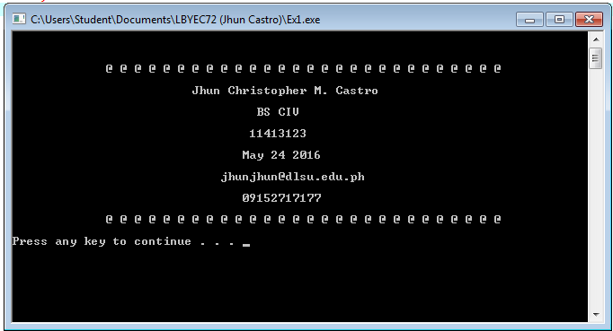

# HelloFromJhunC

Hello world repo!

```
#include <stdio.h>
#include <stdlib.h>

/* run this program using the console pauser or add your own getch, system("pause") or input loop */

int main() 
{
	printf("\n\n");
	printf("\n             @ @ @ @ @ @ @ @ @ @ @ @ @ @ @ @ @ @ @ @ @ @ @ @ @ @ @ @\n");
	printf("\n                         Jhun Christopher M. Castro\n");
	printf("\n                                  BS CIV\n");
	printf("\n                                 11413123\n");
	printf("\n                                May 24 2016\n");
	printf("\n                             jhunjhun@dlsu.edu.ph\n");
	printf("\n                                09152717177\n");
	printf("\n             @ @ @ @ @ @ @ @ @ @ @ @ @ @ @ @ @ @ @ @ @ @ @ @ @ @ @ @");
	printf("\n\n");
	system("pause");
	return 0;
}
```



